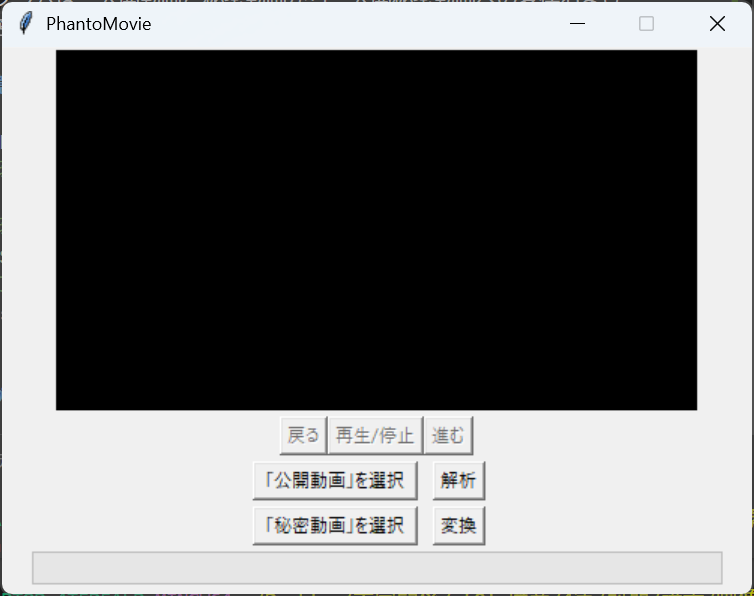

# PhantoMovie

本プログラムは，公開動画と秘密動画から，公開秘密動画への変換および，公開秘密動画を解析し，秘密動画の読み出しを行うプログラムである．



## 環境構築

```bash
# 仮想環境を作成する
python -m venv .venv
# 仮想環境に入る
.venv\Scripts\activate
# ライブラリのインストール
pip install -r requirements.txt
```

## アプリケーションの実行

以下のコマンドを実行して，アプリケーションを起動する．

```bash
# アプリケーションを実行
python main.py
```

## How to use

- **公開動画**：配布したい動画
- **秘密動画**：秘密にしたい動画
- **公開秘密動画**：公開動画の中に，秘密動画を埋め込んだ動画

### 公開動画と秘密動画から公開秘密動画への変換する

1. アプリケーションを実行する
2. 「公開動画」を選択する
3. 「秘密動画」を選択する
4. 「変換」ボタンを押下する
5. 「公開秘密動画」の保存場所を選択する

### 公開秘密動画から秘密動画を読み出す

1. アプリケーションを実行する
2. 「公開秘密動画」を「「公開動画」を選択」から選択する
3. 「解析」ボタンを押下する
4. 「再生/停止」ボタンを押下して，秘密動画を再生する
